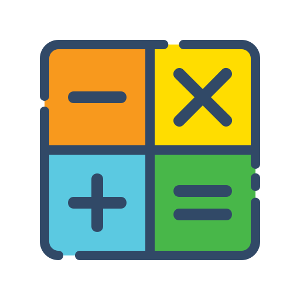

  

    
    <h1 align="center" style="font-size: 48px; font-weight: bold;">Colorful Calculator</h1>
  

  <h2 align="center">A simple calculator app built with Flutter
  </h2>

  

    
        
  

---

## Features

- Calculator
- Able to change theme color and locally saved it with shared_preferences
- Provider to manage state

## About

This is a small personal project. Any comments and reactions would be awesome! Please check
[other projects](https://github.com/ykaito21/flutter_projects/blob/master/project_list.md) too.
