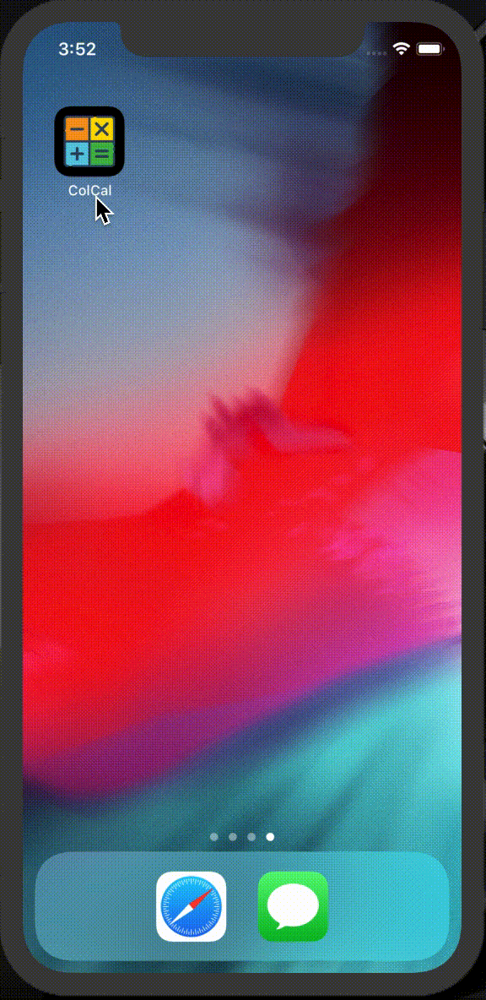

# Colorful Calculator

Colorful Calculator is a simple calculator app built with Flutter.

 


## Packages

- font_awesome_flutter: ^8.5.0
- provider: ^3.2.0
- shared_preferences: ^0.5.4+6

### Building and installing

```
git clone https://github.com/ykaito21/colorful_calculator.git
cd colorful_calculator
flutter run
```
The `flutter run` command both builds and installs the Flutter app to your device or emulator.

<div align="center">
  <div style="align-items: center; width: 300px;">
    
    <h1 align="center" style="font-size: 48px; font-weight: bold;">What2Eat<br>献立スロット</h1>
  </div>
  <h2 align="center">A meal slot app build with Flutter
  </h2>
  <p align="center">
  Record your meal repertoire & Spin a slot to decide what to eat
  </p>
</div>

<div style="align-items: center; display: flex; justify-content: center;">
  <div style="width:200px;">
    <a href="" target="_blank"></img></a>
  </div>
  <div class="" style="width:200px;">
    <a href="" target="_blank"></a>
  </div>
</div>

<div align="center">
  <div style="align-items: center; display: flex; justify-content: center;">
    
        
  </div>
</div>

---

## Features
- Calculator
- Able to change theme color and locally saved it with shared_preferences
- Provider to manage state

## About

This is a small personal project. Any comments and reactions would be awesome!
