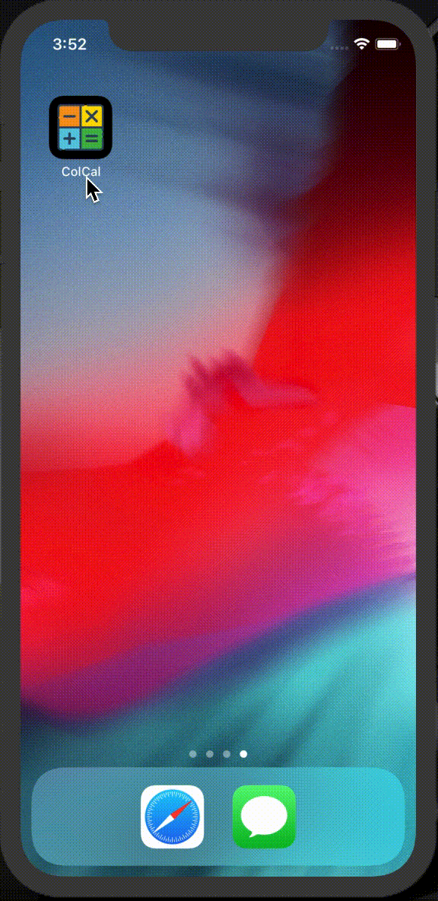

# Colorful Calculator

Colorful Calculator is a simple calculator app built with Flutter.

 


## Packages

- font_awesome_flutter: ^8.5.0
- provider: ^3.2.0
- shared_preferences: ^0.5.4+6

### Building and installing

```
git clone https://github.com/ykaito21/colorful_calculator.git
cd colorful_calculator
flutter run
```
The `flutter run` command both builds and installs the Flutter app to your device or emulator.
